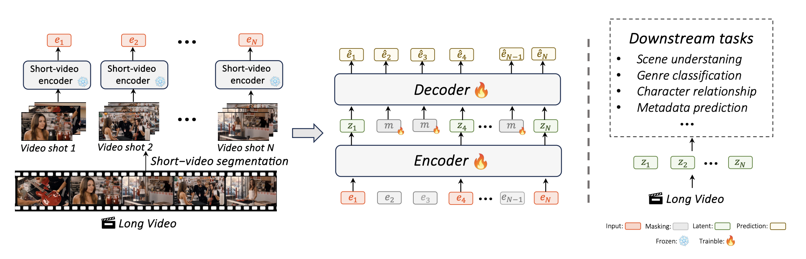

## 📰 News
- (June 2025) We are happy to announce that the paper has been accepted to *ICCV 2025* 🌺

## LV-MAE: Learning Long Video Representations through Masked-Embedding Autoencoders

### [Paper](https://arxiv.org/pdf/2504.03501)

## ℹ️ Overview
We introduce LV-MAE, a self-supervised learning framework for long video representation. The idea is simple: LV-MAE leverages powerful off-the-shelf multimodal encoders to extract embeddings from short video segments, then pre-trains a masked-embedding autoencoder to model high-level interactions across the entire video.
We welcome you to use our code and benchmark to develop new methods and applications for time series data.
Our model can serve as a strong baseline for comparison and evaluation of new models.

## 🛠️ Setup
Download and set up the repository:
```bash
git clone TODO
cd dir_name
```

We provide a [`requirements.yaml`](requirements.yaml) file to easily create a Conda environment configured to run the model:
```bash
conda env create -f requirements.yaml
conda activate lv_mae
```
## 📊 Data

Data can be obtained from the following sources:
- For the LVU benchmark, we followed [ViS4mer](https://github.com/md-mohaiminul/ViS4mer) 
- Download the [Breakfast](https://serre-lab.clps.brown.edu/resource/breakfast-actions-dataset/) dataset.
- Download the [COIN](https://coin-dataset.github.io/) dataset.

To use our method, data must first be preprocessed using off-the-shelf multimodal encoders. We provide example code using the LanguageBind model. Similar code can be applied to other models. To extract features, follow these steps:

1. After downloading the dataset, run `segment_video_library_movie_clip.py` (for movie clips; similar code can be applied to other datasets). This will generate `segments_metadata.csv` containing paths to 5-second segments. The segment length can be easily modified in the code.

2. Using this CSV file, extract paired input/output paths to save the processed embeddings. The code in `prepare_paired_paths.py` creates pairwise paths that will be used in the next step.

3. Using these paths, run `langbind_preprocessing.py` to create LanguageBind embeddings for each segment.

4. Finally, to create the CSV file for training, run `segment_dataframe_movie_clip.py`.

5. This process can be repeated for each dataset, then combine all CSV files into one for training on multiple datasets.

If you use these datasets, please cite the sources as referenced in our [paper](https://arxiv.org/pdf/2504.03501).


## 🔥 Pre-training

For pre-training, you should run `main_pretrain.py` using the following recommended parms:

```bash
python main_pretrain.py --batch_size 16 --dataset combined --decoder_depth 8 --decoder_embed_dim 512 --decoder_num_heads 16 --depth 32 --epochs 151 --input_size 1024 --mask_ratio .5 --num_heads 16 --num_patches 256 --distributed --world_size 8 --masking_strategy
```

## 📈 Evaluating
Evaluate your trained model you can do it via attentive probing or linear probing.

```bash
python test_ap_movie_clip.py --batch_size 16 --task scene --epochs 30 --lr 3e-4
```
```bash
python test_lp_movie_clip.py --batch_size 16 --task scene --epochs 30 --lr 3e-4 
```
We observe small batch sizes perform better. Choose the task using "task" argument.

---

### Acknowledgment  
This project builds upon the [MAE repository](https://github.com/facebookresearch/mae) from the paper *Masked Autoencoders Are Scalable Vision Learners*.


## BibTeX
```
@article{naiman2025lvmae,
  title={{LV-MAE:} Learning Long Video Representations through Masked-Embedding Autoencoders},
  author={Ilan Naiman and Emanuel Ben Baruch and Oron Anschel and Alon Shoshan and Igor Kviatkovsky and Manoj Aggarwal and G{\'{e}}rard G. Medioni},
  journal={CoRR},
  volume={abs/2504.03501},
  year={2025}
}
```


